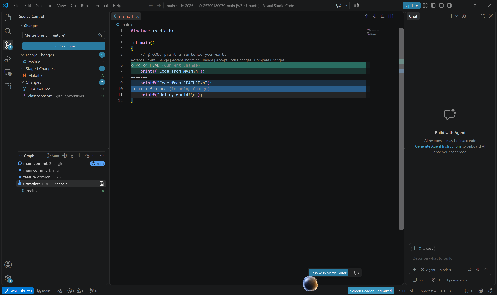
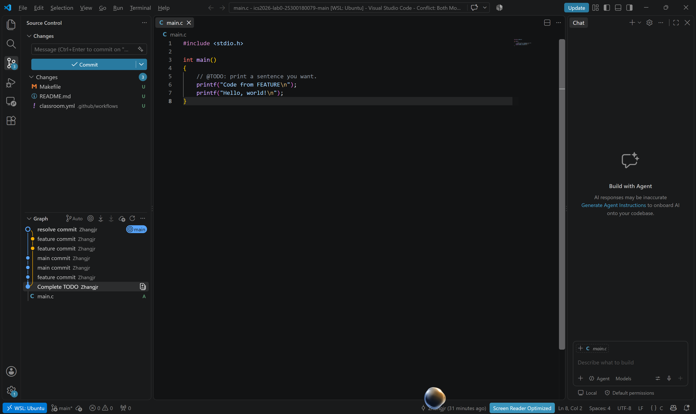

复旦大学计算机系统基础（2026年秋季学期） Lab0: GitLab 实验报告

姓名：张杰瑞
学号：25300180079
仓库链接：https://github.com/Zhangjr-jpg/ics2026-lab0-25300180079

一、 实验目标

1. 在 WSL 2 (Ubuntu) 环境中下载与安装 Git。
2. 学习并掌握 Git 的基本操作（暂存、提交、分支、合并、解决冲突）。
3. 学习使用 VS Code 进行可视化 Git 操作。
4. 配置 GitHub 远程仓库并完成代码推送。

二、 实验环境

· 操作系统：Windows 11 + WSL 2 (Ubuntu 26.04 LTS)
· 开发工具：VS Code（配合 WSL 插件、Git Graph 插件）
· 版本控制：Git

三、 实验步骤与思考题作答

Task 1：Git 基础用法与思考题

1. 多人协同开发的经历与分工方式
由于我此前没有使用版本控制工具进行正式开发的经验，这是我第一次系统地学习 Git。我过去的多人协作（如课程小组作业）主要依靠 QQ/微信发送文件包，或者使用网盘共享。这种方式的弊端非常明显：经常出现版本覆盖、不知道谁改了哪一行、合并代码时只能人工比对等问题，效率极低且易出错。通过本次 Lab0，我深刻认识到了使用 Git 进行协同开发的必要性。

2. 思考：Git 为什么要设计“暂存-提交”两个步骤？
Git 设计“暂存区（Staging Area）”是一个非常巧妙且必要的设计。它允许开发者精准控制每次提交的内容。

· 保证提交的原子性：在开发中，我们可能同时修改了多个文件（例如修了Bug A，又写了Feature B）。通过暂存区，我们可以只把属于Bug A的文件 git add 进去，然后 commit，保证每次提交的逻辑是完整且单一的。
· 避免误提交：防止把调试用的临时文件、包含密码的配置文件、或者半成品代码混入版本历史中，让 Git 的提交历史保持干净清晰。

3. 思考：git branch 和 git branch -a 的区别是什么？

· git branch：仅列出本地存在的分支。
· git branch -a：列出所有分支，包括本地分支和远程仓库（Remote）的分支（以 remotes/origin/... 显示）。-a 代表 all。

Task 2：修改 TODO 并提交

我成功获取了课程模板仓库，并克隆到了本地 WSL 环境中。随后，我定位到了 main.c 文件中 // @TODO 标记的位置，修改了其中的输出语句，并在本地完成了暂存（git add）与提交（git commit）。在此过程中，由于国内网络环境限制，我借助了加速工具以及移动网络热点完成了仓库的初始化和本地提交操作。

Task 3：阅读感悟与为什么要学 Git

我阅读了《Commit Message 规范》和《Git Flow 分支控制》两篇文档。

· 《Commit Message 规范》让我明白，提交信息不能随便写“update”或“fix”，而应该遵循 feat: xxx、fix: xxx 等规范，这让开发者能快速看懂版本历史，也方便生成 CHANGELOG。
· 《Git Flow 分支控制》则展示了 main、develop、feature、release、hotfix 等多分支协作模型，展示了大型项目如何有条不紊地迭代。

对“为什么要学习 Git”的理解：
Git 是现代软件工程的基石。它不仅是备份代码的工具，更是团队协作、版本控制、问题追踪的核心枢纽。学会 Git 可以让我们在代码世界里拥有“时光机”（随时回退），也能让我们拥有“平行宇宙”（多分支开发互不干扰）。对于计算机专业的学生来说，掌握 Git 是走向专业开发的必修课。

Task 4：分支管理与冲突解决

实验步骤：

1. 我在本地 main 分支上提交了代码。
2. 使用 git switch -c feature 创建并切换到 feature 分支，修改了 main.c 中的代码并提交。
3. 切回 main 分支，再次修改 main.c 的同一行代码并提交。
4. 执行 git merge feature 尝试合并，正如预期，两个分支修改了同一行，Git 无法自动合并，触发了冲突（Conflict）。

冲突解决：
在 VS Code 的图形界面中，我点击了 Accept Incoming Change（保留 feature 分支的代码），清理了 <<<<<<< 等冲突标记。
随后，我使用 git add main.c 将文件暂存，并提交了合并结果：git commit -m "resolve conflict"。

四、 实验过程中遇到的问题与解决过程（建议保留，很加分）

在本次实验中，我遇到了不少环境配置和网络方面的挑战：

1. WSL 与 VS Code 的联动：起初在 Windows 端安装了 VS Code，但不知道如何在 Linux 环境中呼出。后来通过终端执行 code . 命令，并安装了官方的 WSL 插件，成功实现了在 Windows 下编辑 Linux 中的代码。
2. 网络环境限制：在尝试 git clone 和 git push 时，由于校园网和家庭宽带对 GitHub 443 端口的拦截，导致连接频繁超时失败（Failed to connect to github.com port 443）。
   · 解决：我通过使用 Watt Toolkit 加速，以及改用手机移动网络热点等方式，成功绕过了网络限制，完成了仓库的初始化和本地提交。
3. Git 操作失误：在练习分支操作时，曾因为未保存文件就切换分支，导致产生了意料之外的提交记录。通过查阅资料，我学会了使用 git reset --hard HEAD~1 命令回退版本，并在 VS Code 的 Graph 图表中确认回退状态，重新进行了规范的操作。

五、 实验总结与心得

作为第一次接触 Git 的新手，本次 Lab0 让我受益匪浅。最初面对黑框命令行时我感到非常迷茫，但在不断试错、解决网络问题、理清 add、commit、branch、merge 以及冲突解决的逻辑后，我终于体会到了 Git 的强大。
尤其是利用 VS Code 的图形化界面（Git Graph），让我能非常直观地看到版本分叉和合并的轨迹。在未来的实验中，我一定会更加熟练地运用 Git 来管理我的 ICS 代码。